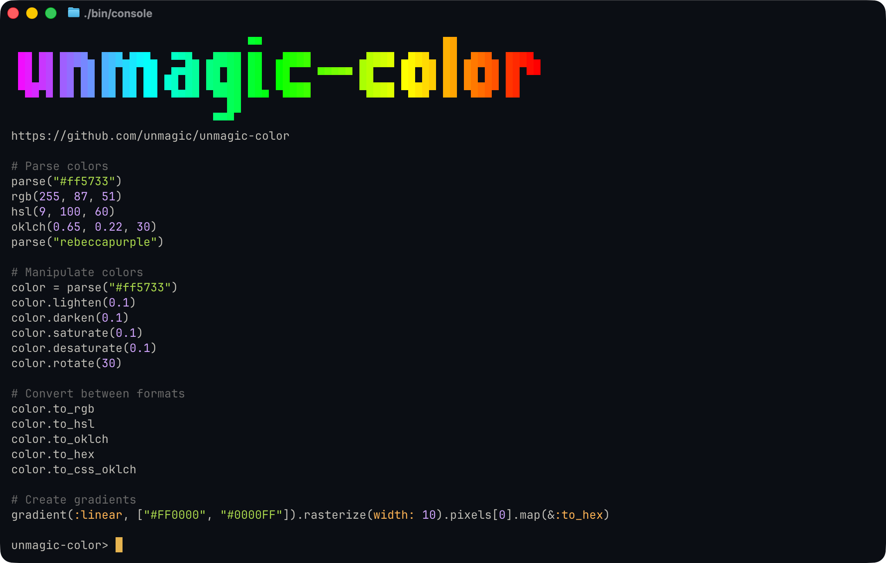

# unmagic-color



A comprehensive Ruby color manipulation library with support for RGB, HSL, and OKLCH color spaces. Parse, convert, and manipulate colors with an intuitive API.

## Installation

Add this line to your application's Gemfile:

```ruby
gem 'unmagic-color'
```

And then execute:

```bash
bundle install
```

Or install it yourself as:

```bash
gem install unmagic-color
```

## Usage Examples

### Parsing Colors

```ruby
# From hex
color = Unmagic::Color.parse("#FF5733")
color = Unmagic::Color["#F57"]  # Short form

# From RGB
color = Unmagic::Color.parse("rgb(255, 87, 51)")
color = Unmagic::Color::RGB.new(red: 255, green: 87, blue: 51)

# From HSL
color = Unmagic::Color.parse("hsl(9, 100%, 60%)")
color = Unmagic::Color::HSL.new(hue: 9, saturation: 100, lightness: 60)

# From OKLCH
color = Unmagic::Color.parse("oklch(0.65 0.15 30)")
color = Unmagic::Color::OKLCH.new(lightness: 0.65, chroma: 0.15, hue: 30)

# From X11 named colors (https://en.wikipedia.org/wiki/X11_color_names)
color = Unmagic::Color.parse("goldenrod")
color = Unmagic::Color["red"]

# Named colors are case-insensitive and whitespace-tolerant
color = Unmagic::Color.parse("Golden Rod")  # Same as "goldenrod"
color = Unmagic::Color.parse("DARK SLATE BLUE")  # Same as "darkslateblue"

# From ANSI escape codes
color = Unmagic::Color.parse("31")              # Red (standard ANSI)
color = Unmagic::Color.parse("38;5;196")        # Red (256-color palette)
color = Unmagic::Color.parse("38;2;255;0;0")    # Red (24-bit true color)
```

### Terminal Colors (ANSI)

Generate ANSI escape codes for colorful terminal output:

```ruby
# Convert any color to ANSI
color = Unmagic::Color.parse("goldenrod")
puts "\x1b[#{color.to_ansi}mHello World!\x1b[0m"

# Foreground colors (default)
red = Unmagic::Color.parse("#ff0000")
puts "\x1b[#{red.to_ansi}mRed text\x1b[0m"

# Background colors
blue = Unmagic::Color.parse("#0000ff")
puts "\x1b[#{blue.to_ansi(layer: :background)}mBlue background\x1b[0m"

# Named ANSI colors use standard codes
Unmagic::Color.parse("red").to_ansi      # => "31"
Unmagic::Color.parse("green").to_ansi    # => "32"

# Custom colors use 24-bit true color
Unmagic::Color.parse("#6496c8").to_ansi  # => "38;2;100;150;200"

# Parse ANSI codes back to colors
color = Unmagic::Color.parse("38;2;100;150;200")
color.to_hex  # => "#6496c8"
```

**Supported ANSI formats:**
- **3/4-bit colors**: `30-37` (foreground), `40-47` (background), `90-97` (bright foreground), `100-107` (bright background)
- **256-color palette**: `38;5;N` (foreground), `48;5;N` (background) where N is 0-255
- **24-bit true color**: `38;2;R;G;B` (foreground), `48;2;R;G;B` (background)

### Converting Between Color Spaces

```ruby
rgb = Unmagic::Color.parse("#FF5733")

# Convert to HSL
hsl = rgb.to_hsl
puts hsl.hue.to_f        # => 9.0
puts hsl.saturation.to_f # => 100.0
puts hsl.lightness.to_f  # => 60.0

# Convert to OKLCH
oklch = rgb.to_oklch

# Convert back to hex
hex = hsl.to_rgb.to_hex
puts hex  # => "#FF5733"
```

### Color Manipulation

```ruby
color = Unmagic::Color.parse("#336699")

# Make it lighter or darker
lighter = color.lighten(0.2)  # 20% lighter
darker = color.darken(0.1)    # 10% darker

# Blend two colors
red = Unmagic::Color.parse("#FF0000")
blue = Unmagic::Color.parse("#0000FF")
purple = red.blend(blue, 0.5)  # 50/50 mix

# Check if color is light or dark
if color.light?
  text_color = "#000000"  # Use dark text
else
  text_color = "#FFFFFF"  # Use light text
end
```

### HSL-Specific Features

```ruby
hsl = Unmagic::Color::HSL.new(hue: 200, saturation: 70, lightness: 50)

# Adjust individual components
brighter = hsl.lighten(0.15)
muted = hsl.desaturate(0.3)
shifted = hsl.adjust_hue(30)

# Create color progressions
palette = hsl.progression(
  steps: 5,
  lightness: [30, 50, 70, 85, 95]
)
# => Array of 5 HSL colors with varying lightness
```

### Generating Colors from Strings

Generate consistent, deterministic colors from any string:

```ruby
# Generate from a user ID or name
color = Unmagic::Color::RGB.derive("user_12345".hash)
color = Unmagic::Color::HSL.derive("john.doe@example.com".hash)

# Customize the output
color = Unmagic::Color::RGB.derive(
  "project_alpha".hash,
  brightness: 200,    # Brighter colors
  saturation: 0.8     # More saturated
)

color = Unmagic::Color::HSL.derive(
  "team_rocket".hash,
  lightness: 60,              # Target lightness
  saturation_range: (50..70)  # Saturation range
)
```

### Advanced: Hash Functions for Color Generation

For more control over how strings map to colors, use hash functions:

```ruby
# Use different hash algorithms
hash_value = Unmagic::Color::String::HashFunction::DJB2.call("username")
color = Unmagic::Color::RGB.derive(hash_value)

# Color-aware hashing (biases toward color names in string)
hash_value = Unmagic::Color::String::HashFunction::COLOR_AWARE.call("red_team")
# Will produce a reddish color

# Available hash functions:
# - SUM: Simple, anagrams get same color
# - DJB2: Good general-purpose distribution
# - BKDR: Excellent distribution (default)
# - FNV1A: Maximum variety for sequential strings
# - SDBM: Good for database IDs
# - JAVA: Compatible with Java's hashCode
# - CRC32: Most uniform distribution
# - MD5: Cryptographic hash (slower)
# - POSITION: Order-sensitive
# - PERCEPTUAL: Case-insensitive
# - COLOR_AWARE: Detects color names
# - MURMUR3: Fast with excellent distribution
```

### Working with Color Components

```ruby
rgb = Unmagic::Color::RGB.new(red: 255, green: 87, blue: 51)

# Access components
puts rgb.red.to_i    # => 255
puts rgb.green.to_i  # => 87
puts rgb.blue.to_i   # => 51

hsl = Unmagic::Color::HSL.new(hue: 180, saturation: 50, lightness: 60)

# Access components
puts hsl.hue.to_f         # => 180.0
puts hsl.saturation.to_f  # => 50.0
puts hsl.lightness.to_f   # => 60.0

# Components support arithmetic
new_hue = hsl.hue + 30  # Shift hue by 30 degrees
```

### Luminance and Contrast

```ruby
color = Unmagic::Color.parse("#336699")

# Get luminance (0.0 = black, 1.0 = white)
lum = color.luminance  # => ~0.2

# Check if light or dark
color.light?  # => false
color.dark?   # => true

# Choose contrasting text color
text_color = color.light? ? "#000000" : "#FFFFFF"
```

### Gradients

Create smooth color transitions with gradients in RGB, HSL, or OKLCH color spaces:

```ruby
# Simple gradient - auto-detects color space
gradient = Unmagic::Color::Gradient.linear(["#FF0000", "#0000FF"])
bitmap = gradient.rasterize(width: 10)

# Access the colors
colors = bitmap.pixels[0]  # Array of 10 colors from red to blue
colors.map(&:to_hex)
# => ["#ff0000", "#e60019", "#cc0033", ..., "#0000ff"]

# Create gradients with multiple stops
gradient = Unmagic::Color::Gradient.linear([
  "#FF0000",  # Red at start (0%)
  "#00FF00",  # Green at middle (50%)
  "#0000FF"   # Blue at end (100%)
])
bitmap = gradient.rasterize(width: 20)

# Use explicit positions (like CSS linear-gradient)
gradient = Unmagic::Color::Gradient.linear([
  ["#FF0000", 0.0],   # Red at start
  ["#FFFF00", 0.3],   # Yellow at 30%
  "#00FF00",          # Green auto-balances at 65%
  ["#0000FF", 1.0]    # Blue at end
])

# Specify gradient direction
gradient = Unmagic::Color::Gradient.linear(
  ["#FF0000", "#0000FF"],
  direction: "to right"
)

# Use angle directions
gradient = Unmagic::Color::Gradient.linear(
  ["#FF0000", "#0000FF"],
  direction: "45deg"  # or just 45
)

# 2D gradients with width and height
gradient = Unmagic::Color::Gradient.linear(
  ["#FF0000", "#0000FF"],
  direction: "to bottom right"
)
bitmap = gradient.rasterize(width: 100, height: 100)

# Access individual pixels
color = bitmap.at(50, 50)  # Get color at x=50, y=50

# Choose color space for different effects
# RGB gradients - direct color component interpolation
rgb_gradient = Unmagic::Color::RGB::Gradient::Linear.build(["#FF0000", "#0000FF"])

# HSL gradients - smoother transitions through the color wheel
hsl_gradient = Unmagic::Color::HSL::Gradient::Linear.build([
  "hsl(0, 100%, 50%)",    # Red
  "hsl(240, 100%, 50%)"   # Blue
])

# OKLCH gradients - perceptually uniform transitions
oklch_gradient = Unmagic::Color::OKLCH::Gradient::Linear.build([
  "oklch(0.5 0.15 30)",   # Orange
  "oklch(0.7 0.15 240)"   # Blue
])
```

**Supported direction formats:**
- Keywords: `"to top"`, `"to right"`, `"to bottom left"`, etc.
- From/to: `"from left to right"`, `"from bottom to top"`
- Angles: `"45deg"`, `"90deg"`, or numeric values like `45`, `90`
- Direction objects: `Unmagic::Color::Units::Degrees::Direction::LEFT_TO_RIGHT`

## Color Spaces

### RGB (Red, Green, Blue)
Standard color space for displays. Values range from 0-255 for each component.

```ruby
Unmagic::Color::RGB.new(red: 255, green: 87, blue: 51)
```

### HSL (Hue, Saturation, Lightness)
Intuitive color space for human-friendly color manipulation.
- Hue: 0-360 degrees (color wheel position)
- Saturation: 0-100% (color intensity)
- Lightness: 0-100% (brightness)

```ruby
Unmagic::Color::HSL.new(hue: 180, saturation: 70, lightness: 50)
```

### OKLCH (Lightness, Chroma, Hue)
Perceptually uniform color space that better matches human color perception.

```ruby
Unmagic::Color::OKLCH.new(lightness: 0.65, chroma: 0.15, hue: 180)
```

## Requirements

- Ruby >= 3.0

## Development

After checking out the repo, run `bundle install` to install dependencies. Then, run `bundle exec rspec` to run the tests.

## Contributing

Bug reports and pull requests are welcome on GitHub at https://github.com/unreasonable-magic/unmagic-color.

## License

The gem is available as open source under the terms of the [MIT License](https://opensource.org/licenses/MIT).
